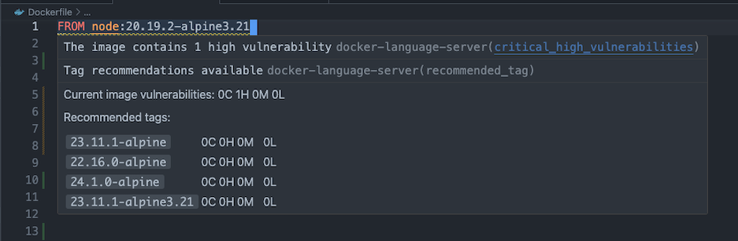
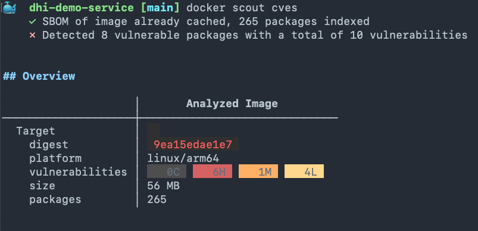
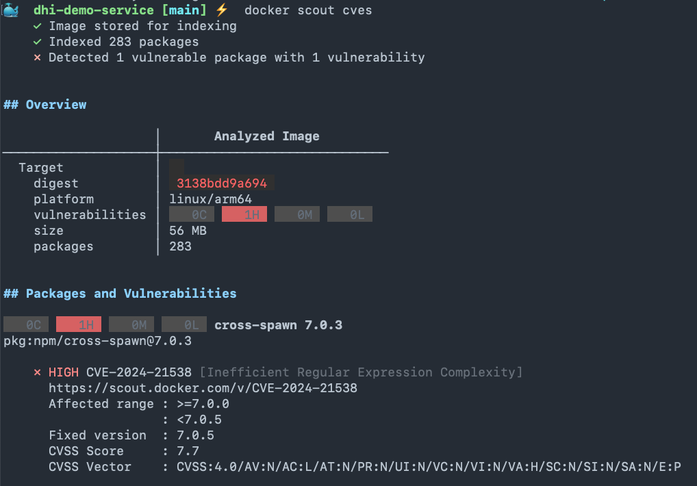
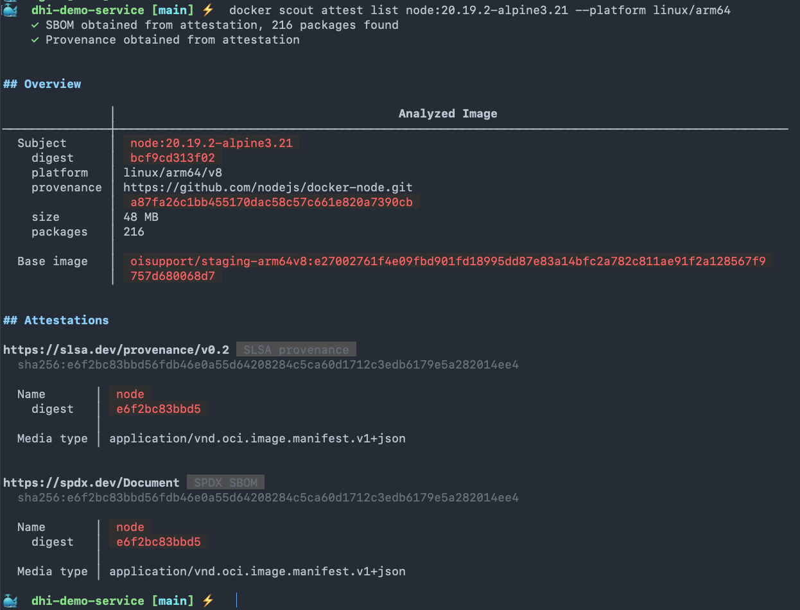
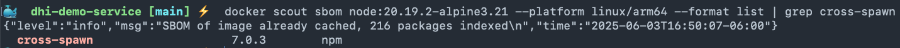
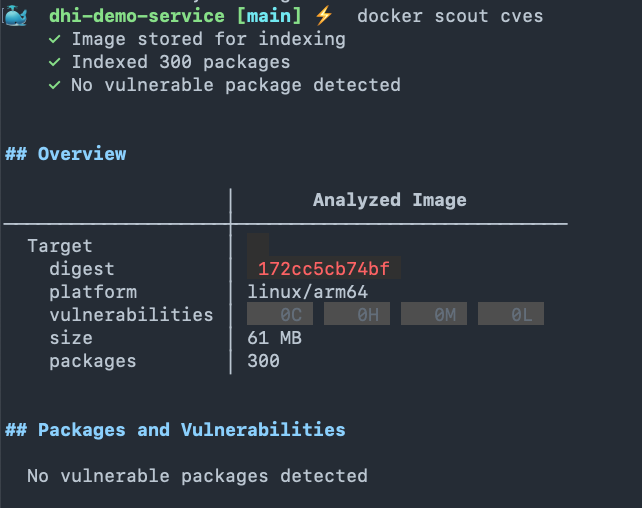

# Docker DHI Demo Service

A repository containing a **Hello World** Node.js application consisting of a basic ExpressJS server (forked from [docker/scout-demo-service](https://github.com/docker/scout-demo-service) and Dockerfile pointing to an Alpine Base image to demonstrate the use of Docker Hardened Images (DHI).

> **Note:** Initial artifacts intentionally contain malware. As a developer, we will walk through the analysis and remediation of the CVEs in the ExpressJS package and in the Node base image.

---

## Introduction to DHI User Interface

Start the demo by giving an introduction to DHI:

1. **Walkthrough the DHI interface**
    - [DHI Hardened Images on Docker Hub](https://hub.docker.com/orgs/demonstrationorg/hardened-images)
    - Show the **Featured images** section, filtering, and categorization.

2. **Filter by `Node` and select the `Node.js` DHI Repository**
    - [Node.js DHI Repository](https://hub.docker.com/orgs/demonstrationorg/hardened-images/dhi/node)
    - Walk through the **Overview** and **Guides** tabs.

3. **Show Tags for the Node Image**
    - [Node Image Tags](https://hub.docker.com/orgs/demonstrationorg/hardened-images/dhi/node/tags)

4. **Filter the `20.19` tags**
    - Use the latest available tag (e.g., `20.19.2` for Node.js and `3.21` for Alpine).
    - **Highlight:**  
        - The **dev** variant contains:
            - `shell` with `busybox`
            - `apk` package manager
            - Runs as `root`
        - The **runtime** variant:
            - No package manager or shell
            - Runs as `node(1000)` (not `root`)
    - Click the **Scout Health Score** icon (Green A) to show Docker Scout policies:
        - No high-profile vulnerabilities
        - No fixable critical or high vulnerabilities
        - Signed supply chain attestations
        - Signed commit from trusted identity
        - No default root user for non-dev images
        - No embedded secrets
        - No embedded malware
        - No failing tests

5. **Open two browser tabs:**
    - One for `20.19.2-alpine3.21-dev`
    - One for `20.19.2-alpine3.21`

    1. **On the `-dev` tag page:**
        - Go to the **Packages** tab.
        - Point out included packages (`npm`, `curl`, etc.).
        - **Call out the size:** `41.81 MB`
    2. **On the runtime tag page:**
        - Show that the above packages are not present.
        - **Highlight the size:** `31.64 MB`
    3. **Show the `Specifications` tab:**
        - Contains Dockerfile details and Git Commit.
    4. **Show the `Vulnerabilities` tab:**
        - No vulnerabilities exist (as of this commit).
    5. **Show the `Attestations` tab:**
        - DHI images include comprehensive security attestations:
            - SBOMs
            - Virus Scan results
            - Secrets Scan results
            - SLSA Verification Attestation (VSA)

---

## Demo Flow

1. **Clone this repo:**
    ```sh
    git clone https://github.com/DockerSolutionsEngineering/dhi-demo-service.git
    ```

2. **Open the Dockerfile in your IDE (VSCode required for some steps):**
    ```sh
    code .
    ```

3. **Explain the base image:**
    - The application uses the [Node.js Docker Official Image (DOI)](https://hub.docker.com/_/node) from Docker Hub.
    - Docker, Inc. maintains these images with upstream maintainers and security experts and the Docker community. This image is open sourced.
    - **Show:**  
        - `FROM node:20.19.2-alpine3.21` in the Dockerfile.
        - Hover the yellow warning squiggle in VSCode (powered by the [Docker DX VSCode Extension](https://marketplace.visualstudio.com/items?itemName=docker.docker&ssr=false#overview)).
        - This indicates a High Severity Vulnerability in the base image.
        - Click the link to view the DOI's page on Docker Hub.

    

4. **Build an image from this Dockerfile:**
    ```sh
    docker build -t demonstrationorg/dhi-demo-node:20.19.2-alpine3.21 .
    ```

5. **Scan the built image with Docker Scout:**
    ```sh
    docker scout cves
    ```

    

    > **Note:**  
    > In addition to the High vulnerability in the base image, Docker Scout detected High, Medium, and Low vulnerabilities in packages installed with npm:
    > ```Dockerfile
    > RUN apk add --no-cache npm \
    >     && npm i --no-optional \
    > ```
    > A typical next step is to update dependencies in `package.json` (e.g., using Dependabot).

6. **Update the `package.json` file:**
    - Change the ExpressJS dependency from:
        ```json
        "express": "4.17.1"
        ```
      to:
        ```json
        "express": "4.21.2"
        ```
    - This leaves only the base image vulnerability left to be fixed.

7. **Rebuild and rescan the image:**
    - Repeat steps 4 and 5.

    

    - As shown, fixing vulnerabilities rooted in the packages installed by my own application team can be straightforward. In contrast, Vulnerabilities found in base images can be time consuming to investigate and remediate. A typical framework DOI like Node.js is built on top of another base image. A vulnerability could come from a package found in the Alpine distribution or from the Node.js ecosystem:
    
    - The Docker DOI Node base image starts with alpine:3.21 and then installs node 20.19.2 on top of it. A savvy Docker user would perhaps look at the sources below to have a better understanding of how the DOI image is built, since it's open sourced:

       - Sources:
            - Start with the [DockerHub Node DOI](https://hub.docker.com/_/node) page and find the GitHub repo that builds it
            - Investigate the [Dockerfile for DOI Node 20.19Alpine3.21](https://github.com/nodejs/docker-node/blob/main/20/alpine3.21/Dockerfile) to get additional insights into the Node.js DOI image
            
     
       - In this specific case, **cross-spawn 7.0.3** is a npm package that was bundled during the creation of the Node base image. It's not rooted in the Alpine base image.
            - [Cross-spawn NPM Source](https://www.npmjs.com/package/cross-spawn)

        - We'll show how an user can get more insights using Docker Scout later in the demo flow.

    >**Considerations**
    > - Fixing vulnerabilities can be a frustrating and time consuming process. Developers or app security engineers often have to dig deep to trace where the vulnerability originated from, especially since the base image is usually a black box to them. Many developers lack the expertise to pinpoint exactly when or how the vulnerability was introduced.
    > - Often, the fastest solution is to upgrade the base image to a newer version that will contain the fix via a minor upgrade or doesn't contain the offending package. This is why Docker Scout includes [docker scout recommendations](https://docs.docker.com/reference/cli/docker/scout/recommendations/). Nonetheless, it may require upgrading Node.js and or Alpine versions. This upgrade could require changes in the application due to unforeseen incompatibilities. All of those considerations could result in back and forth meetings between application development teams and security teams. It could lead to waiting in a queue for hours/days. This will highly depend on each organization's internal remediation process.
    > - They could also build a ```NodeJS v20.19.2 + Alpine v3.2``` base image from scratch without the offending package or with an upgraded version of the offending package. This route would require more in depth knowlege and it defeats the purporse of starting with the DOI image to begin with.
    > - They  could also try to simply remove the offending package, assuming that the package is not consumed. As this user opted to do: https://github.com/npm/cli/issues/7902#issuecomment-2484788217
    > - Regardless of how software teams decide to address this issue, it will require substantial amount of time that they could be investing in creating value add solutions instead.

8. **Investigating the Attestations availble with the DOI Node image:**
    - If a security engineer or software developer would like evidence that the cross-spawn 7.0.3 package was introduced with the base image, they could look at Docker Desktop user interface, by opening the Image in question and  looking at the results of the Vulnerability Analysis. In addition, the attestations provided with the Node DOI could also confirm this information. Let's run the following command to retrieve attestations from the Node DOI image:

     ```sh
    docker scout attest list node:20.19.2-alpine3.21 --platform linux/arm64.
    ```

    

9. **Retrive the SBOM using Docker Scout:**
     - Notice that the attestations include a SBOM (Software Bills of Materials). We can run the following command to retrieve the SBOM while running a grep for cross-spawn specifically.

     ```sh
    docker scout sbom node:20.19.2-alpine3.21 --platform linux/arm64 --format list | grep cross-spawn
    ```

    

10. **Replacing base image with demonstrationorg/dhi-node:**
    - Now that we are confident that the root issue is in the Node DOI base image, we can resort to the image provided by the Docker Hardened Image Catalog. As we saw in the beginning, DHI provides us with two versions of a NodeJS 20.19.2 image based on Alpine 3.21, one for development (-dev) and one for runtime. The **dhi-node:20.19.2-alpine3.21-dev** tag comes as a perfect replacement for my existing base image since it runs on the same versions of NodeJS and Alpine. Let's edit the ```FROM``` instruction in my ```Dockerfile``` to point to the new base image provided by DHI.

    - FROM:

        -  ```sh 
            FROM node:20.19.2-alpine3.21
            ```

    - TO:

        - ```sh 
          FROM demonstrationorg/dhi-node:20.19.2-alpine3.21-dev
          ```

11. **Replacing base image with demonstrationorg/dhi-node:**
    - Rebuild the image and run the ```docker scout cves``` command again, repeating steps 4 and 5 above.

    

12. **Summary**
    - By replacing our base image with the matching, vulnerability-free DHI image, we quickly produced a CVE-free application image. This saved significant time on research, testing, and coordination, allowing our team to remediate the issue faster and deliver a more secure deployment to our customers.


### [To be Continued] ###
- There is a lot more we can do with this:

    1. Add the check base image scout policy to the workflow (Yusuf)

    1. Build a multi-stage Dockerfile using the runtime variant in addition to the dev variant

    1. Check attestations from the DHI image and validate signature before building image

    1. Create a GitHub Actions workflow automating this process


 


---

*Continue applying similar formatting for the rest of the document for clarity and readability.*